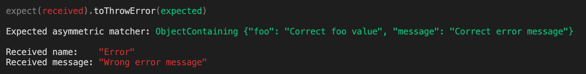
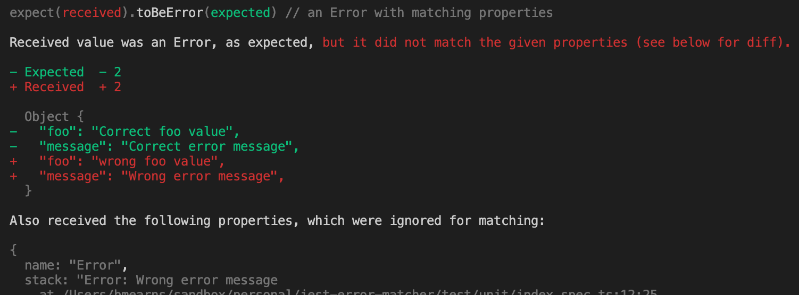

# jest-error-matcher

---

Provides a custom matcher for [Jest](https://jestjs.io/) that does more rigorous matching on errors and, most importantly, better error reporting when the match fails.

This is especially useful when your error objects have attached properties; it can be very difficult with Jest's default diffing and output
to know where they failed to match.

## Overview

```javascript
import "jest-error-matcher";

/* import your module under test */

it("should throw an error with useful properties attached", () => {
    expect(myFunctionUndertest).toThrowErrorMatching({
        name: "MyError",
        message: expect.stringMatching(/something went wrong with code E[0-9]+/),
        code: expect.stringMatching(/^E[0-9]+/$)
    });
});

it("should rejet with a useful Error", () => {
    expect(myAsyncFunctionUnderTest).rejects.toThrowErrorMatching({
        name: "MyError",
        /* ... */
    });
});
```

## Matchers Provided

When imported, this package adds the following matchers to Jest's `expect` object:

- `toThrowErrorMatching(expected?)` - This acts similar to the Jest default `toThrow` matcher, expecting the subject to be a function which throws an error.
- `toBeErrorMatching(expected?)` - This applies the same matcher rules as `toThrowErrorMatching`, but instead of expecting a function to throw an error,
  it expects the subject to be the Error object itself.

Both matchers take an optional object against whose properties the error is matched. Additionally, the matchers expect that the error is an instance of
the `Error` class. If no argument is given, the matchers will only verify that the error is an instance of `Error`.

Only those own-properties that are specified for `expected` will be subject to the match. Any properties on the error that are not included in `expected`
will be ignored.

## Negation

These matchers **do no support negation** (e.g., `expect(...).not.toBeErrorMatching(...)` will throw an Error). This is because it's somewhat ambiguous
to say we expect a function to not throw an error matching an expected value: do you mean it shouldn't throw any error or that it should throw an error,
but one that doesn't match?

## Value Added over `toThrow`

We've learned that rich errors can be very helpful, where the Error object is adorned with properties providing details and context in a machine-readable way.
These properties allow for easier and safer error-handling and monitoring than trying to parse information from an error message. However, the built in `toThrow`
matcher for Jest (and it's alias `toThrowError`) doesn't support this well. You can use assymetric matchers like `expect.objectContaining` to match against
custom properties, but when your expectation fails, the output is not terribly helpful. Specifically, it doesn't show you any custom properties of the error,
and it doesn't show a diff the way other object matchers do.

For instance, using the built-in `toThrow` matcher...

```javascript
expect(() => {
  throw Object.assign(new Error("Wrong error message"), {
    foo: "wrong foo value",
  });
}).toThrowError(
  expect.objectContaining({
    foo: "Correct foo value",
    message: "Correct error message",
  })
);
```

...you get the following output:



Using the custom matchers provided by the this package...

```javascript
expect(() => {
  throw Object.assign(new Error("Wrong error message"), {
    foo: "wrong foo value",
  });
}).toThrowErrorMatching({
  foo: "Correct foo value",
  message: "Correct error message",
});
```

...you get much more useful output:



## Bugs and Pull Requests

Please report bugs on github at [mearns/jest-error-matcher/issues](https://github.com/mearns/jest-error-matcher/issues).

If you have an enhancement you'd like to make, you can submit a pull request to [mearns/jest-error-matcher](https://github.com/mearns/jest-error-matcher/),
but I suggest you open an [issue](https://github.com/mearns/jest-error-matcher/issues) first to discuss the idea before you spend a lot of time on it.
